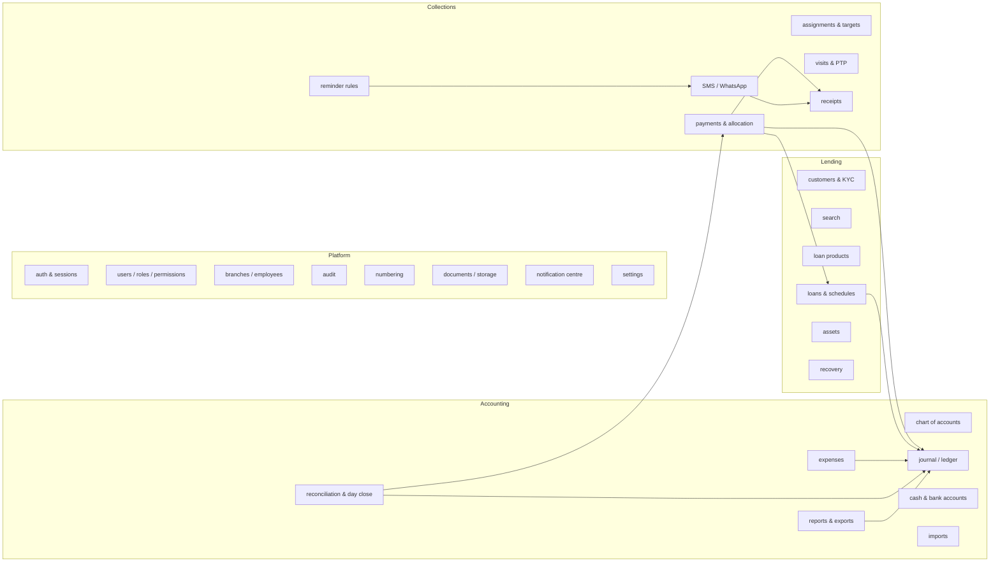

# 02 — System Architecture

## 1. Architecture style

**Modular monolith.** One deployable API with strictly separated modules and one
PostgreSQL database. Rationale:

- Financial operations must be **atomic across modules** (a payment touches
  loans, collections, receipts and the ledger). A single DB transaction is far
  safer than distributed sagas at this scale.
- Team is small; microservices would add ops cost with no benefit.
- Module boundaries (below) are enforced in code (lint rules on imports), so a
  module can be extracted later if ever needed.

Background work (SMS, WhatsApp, PDFs, reminders, accruals, statement matching)
runs in **worker processes** from the same codebase, fed by a Redis-backed job
queue, using the **transactional outbox** pattern so no message is sent for a
transaction that rolled back.

## 2. Technology stack

| Concern | Choice | Why |
|---|---|---|
| Language | TypeScript (strict) everywhere | One language, shared types & validation schemas |
| Monorepo | pnpm workspaces + Turborepo | Shared packages (money, calc engine, schemas) |
| Web app | **Next.js 15 (App Router), React, Tailwind, shadcn/ui** | Desktop + mobile-responsive UI; server components for fast first load |
| API | **NestJS** (separate app) | Guards/interceptors make per-endpoint authorization, audit and idempotency uniform; clean module DI; easier to test than route handlers. Next.js calls it server-side; browser calls it via same-origin `/api` rewrite |
| DB | **PostgreSQL 16** | `NUMERIC`, row locks, deferred constraints, triggers, RLS, `pg_trgm`, PITR |
| ORM | **Prisma** for CRUD + **Kysely/raw SQL** for ledger & reports | Prisma for productivity; hand-written SQL where locking/aggregation precision matters |
| Validation | **Zod** schemas in `packages/contracts` | Same schema validates UI forms and API input |
| Money | `decimal.js` wrapped in a `Money` value type (`packages/money`) | No floats anywhere; banker's-safe explicit rounding modes |
| Queue | **BullMQ on Redis** | Retries, backoff, scheduled jobs, rate limits for providers |
| Cache / rate limit / sessions index | Redis | |
| Files | S3-compatible (AWS S3 ap-south-1), SSE-KMS, private buckets, presigned URLs | |
| PDF | **Playwright (headless Chromium) rendering HTML templates** in workers | Pixel-accurate, supports Indic fonts (Noto Sans Telugu/Devanagari) later |
| Excel | **ExcelJS** (streaming writer for large exports) | |
| Auth | Custom session auth in NestJS (opaque session ID cookie, server-side session store) + TOTP (otplib) + argon2id | Instant revocation ("logout all devices") which stateless JWT cannot give |
| Observability | OpenTelemetry → Grafana/Loki/Tempo or CloudWatch; Sentry for errors | |
| Tests | Vitest (unit), Supertest + Testcontainers Postgres (integration), Playwright (E2E) | |

## 3. Repository layout

```
financiers/
├─ apps/
│  ├─ web/              Next.js — desktop console + mobile collector UI (/m/*)
│  ├─ api/              NestJS HTTP API
│  └─ worker/           NestJS standalone — queues, cron, outbox relay
├─ packages/
│  ├─ money/            Money type, rounding, INR formatting
│  ├─ loan-engine/      Pure calc engine: schedules, APR, penalties (no I/O)
│  ├─ allocation/       Pure allocation engine (no I/O)
│  ├─ contracts/        Zod schemas + generated TS types + OpenAPI
│  ├─ db/               Prisma schema, SQL migrations, triggers, seeds
│  ├─ ui/               Design system (tokens, table, form, badge, dialog)
│  └─ config/           eslint, tsconfig, module-boundary rules
└─ docs/
```

`loan-engine` and `allocation` are **pure functions** — given inputs, return
outputs, no DB. That makes them exhaustively unit-testable and lets the UI
preview exactly what the server will post.

## 4. Module map (API)



Rule: **only the `GL` module writes `journal_entries`/`journal_lines`.** Other
modules call `LedgerService.post(postingEvent)`; posting rules (doc 07) turn a
business event into balanced lines.

## 5. Request lifecycle (every API call)

```
HTTPS (TLS 1.2+) → ALB/WAF → Next.js (/api rewrite) → NestJS
  1. Helmet security headers, request-id
  2. Rate limiter (Redis; per IP + per user + per route class)
  3. Session guard: cookie → session row (Redis cache) → user, roles, branches;
     idle timeout 30 min, absolute 12 h
  4. CSRF guard on unsafe methods (double-submit token + SameSite=Strict + Origin check)
  5. Zod validation (reject unknown fields)
  6. Permission guard: @Require('payment.create') → RBAC check
  7. Scope guard: resource branch ∈ user's branches; collector → assigned customers
  8. Idempotency interceptor (financial POSTs): Idempotency-Key header
  9. Handler → service → DB transaction (SERIALIZABLE or row locks as documented)
 10. Audit interceptor writes audit_logs in the same transaction
 11. Outbox rows (receipt PDF, WhatsApp, SMS) in the same transaction
```

## 6. Financial transaction pattern

All money-moving commands follow one template (example: record payment):

```ts
await db.transaction(async (tx) => {
  await idempotency.claim(tx, key, userId, requestHash);        // unique constraint
  const loan = await tx.lockLoan(loanId);                       // SELECT … FOR UPDATE
  assertBusinessDayOpen(tx, loan.branchId, valueDate);          // day-close guard
  const dues = await tx.openInstallments(loanId);               // locked rows
  const plan = allocate(dues, amount, product.allocationRule);  // pure
  const payment = await tx.insertPayment(...);
  await tx.insertAllocations(payment.id, plan.lines);
  await tx.applyToInstallments(plan);                           // balances/status
  const receiptNo = await numbering.next(tx, 'RECEIPT', branch, fy); // gapless
  await tx.insertReceipt(...);
  await ledger.post(tx, PostingEvent.PaymentReceived(payment, plan)); // balanced or throw
  await tx.updateLoanBalances(loanId);                          // denormalised, verified nightly
  await outbox.enqueue(tx, ['receipt.pdf', 'receipt.whatsapp', 'receipt.sms']);
  await audit.log(tx, 'payment.created', ...);
  await idempotency.complete(tx, key, response);
});
```

Any throw → full rollback. Nothing leaves the DB boundary until commit (outbox).

## 7. Concurrency & integrity guarantees

| Risk | Control |
|---|---|
| Two collectors pay the same installment at once | `SELECT … FOR UPDATE` on loan row; allocation computed inside lock |
| Double-tap / retry | Client-generated `Idempotency-Key` (UUIDv4 created when the form opens) + unique `(user_id, key)`; replay returns original response |
| Same UPI UTR used twice | Unique partial index on `(method, reference_no)` for non-reversed UPI/bank payments |
| Unbalanced journal | DB constraint trigger (deferred) asserts Σdebit = Σcredit per entry at commit |
| Editing closed days | Trigger rejects inserts into `journal_lines` whose `value_date` falls in a closed business day/locked period (except `REVERSAL`/`ADJUSTMENT` entries dated today) |
| Deleting history | App DB role has no `UPDATE/DELETE` on `journal_*`, `audit_logs`; payments/receipts only allow status transitions via SECURITY DEFINER functions |
| Duplicate receipt numbers | `numbering_sequences` row lock → gapless; unique constraint on `(type, number)` |
| Denormalised balance drift | Nightly job recomputes loan & employee balances from ledger/allocations; any difference raises an alert, never silently fixed |

## 8. Collector mobile experience

- Same Next.js app, route group `/m/*`, mobile-first layout with bottom nav
  (Home · Customers · Collect · Day · More).
- Server components render today's list; data trimmed to what the card shows.
- Installable PWA (manifest + service worker caching **static assets only** in V1).
- Network-aware submit: button disables on tap; request retried with the *same*
  idempotency key on timeout; UI shows "Confirming…" until server ack; a
  pending-payment banner survives reload (key stored in IndexedDB) so the
  employee never re-enters a payment that may already be posted.
- Future offline mode: queue of signed "collection intents" synced with the same
  idempotency keys; server remains the only place that posts to the ledger.

## 9. Messaging architecture

```
Business event ─▶ outbox ─▶ worker ─▶ TemplateRenderer ─▶ ChannelAdapter ─▶ Provider
                                               │                 (MSG91 | Gupshup | Twilio | Meta Cloud API | BSP)
                                               ▼
                                     sms_logs / whatsapp_logs ◀── delivery webhooks (signed)
```

- `ChannelAdapter` interface: `send(message) → providerMessageId`,
  `parseWebhook(req) → DeliveryStatus`. Provider credentials encrypted in
  `provider_configs`, selected per company/branch.
- SMS templates carry the **DLT template ID** and entity/header IDs.
- WhatsApp: approved template name + language + variable mapping; media
  (receipt PDF) via short-lived presigned URL; only to customers with recorded
  opt-in.
- Rate limits and quiet hours (e.g. no reminders 21:00–08:00 IST) enforced in
  the worker.

## 10. Scheduled jobs (worker)

| Job | When (IST) | What |
|---|---|---|
| `installment.status-roll` | 00:05 daily | Upcoming→Due today→Overdue, DPD update |
| `interest.accrue` (if D1 = accrual) | 00:10 | Post interest receivable for installments due today |
| `penalty.assess` | 00:15 | Apply penal charges past grace per product rule |
| `reminders.plan` | 07:30 | Evaluate reminder rules, enqueue messages |
| `collection.targets` | 00:30 | Build today's collection sheet per employee |
| `balances.verify` | 02:00 | Recompute sub-ledgers vs GL; alert on drift |
| `audit.chain-verify` | 03:00 | Verify audit log hash chain |
| `backup.verify` | weekly | Restore latest snapshot to scratch DB, run checks |

All jobs are idempotent per (job, business_date).

## 11. Multi-branch & tenancy

Single company (tenant) in V1, multiple branches. Every business row carries
`branch_id`. Branch scoping enforced in the Scope guard **and** by PostgreSQL
Row-Level Security policies keyed on `current_setting('app.branch_ids')` as a
defence-in-depth layer. A `company_id` column is present on top-level tables so
multi-company is possible later without migration pain.
