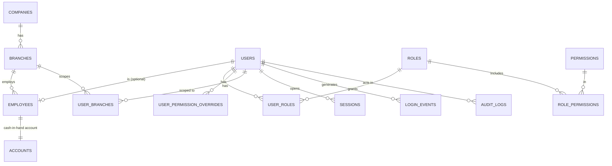
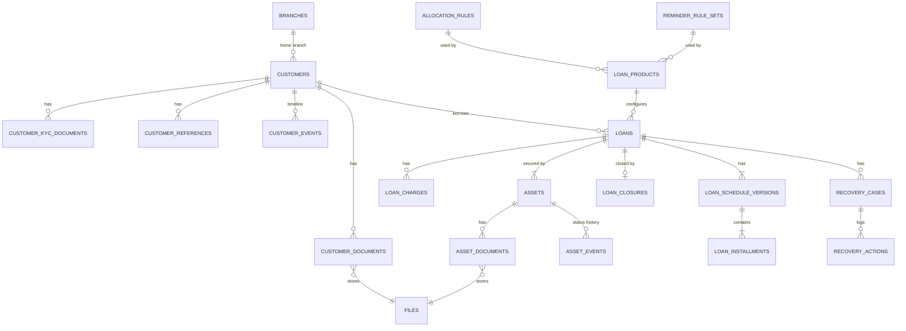
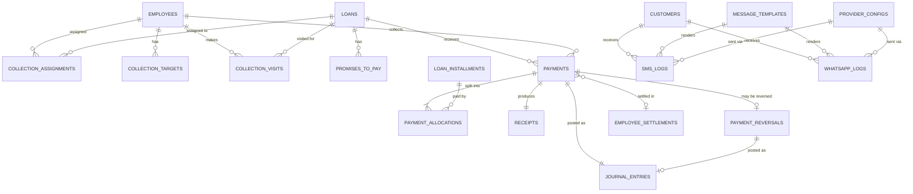
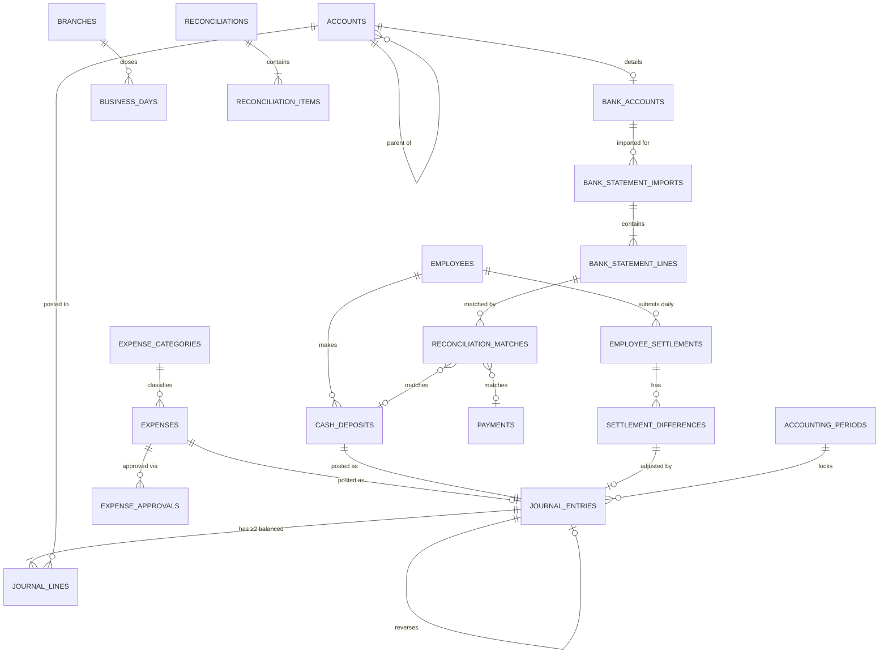
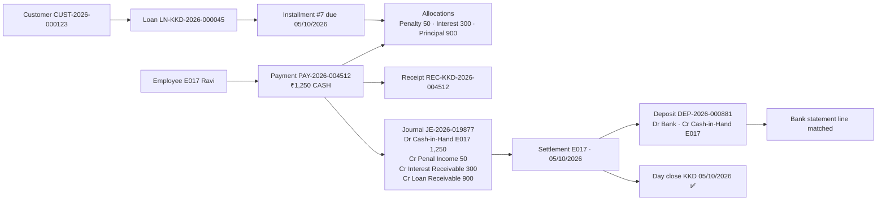

# 04 — ER Diagram

Rendered by GitHub (Mermaid). Split into four views for readability; column
details are in [03-database-schema.md](03-database-schema.md).

## 4.1 Identity, org & audit

## 4.2 Lending

## 4.3 Collections & payments

## 4.4 Accounting & reconciliation

## 4.5 The traceability chain

One ₹1,250 cash payment, followed end to end:

