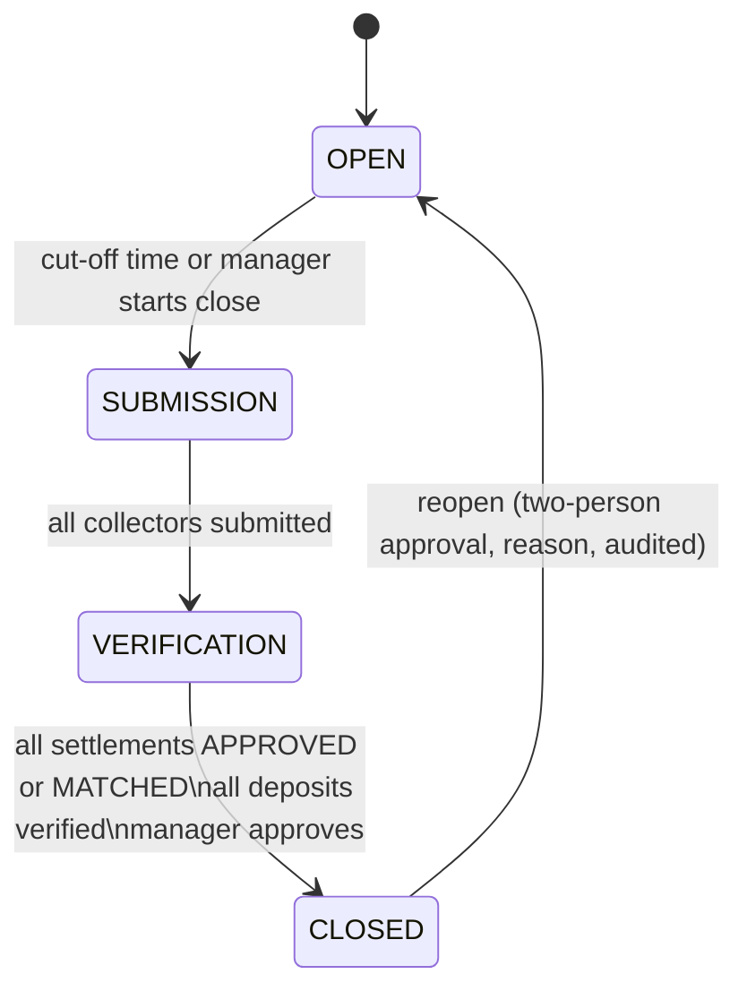

# 09 — Reconciliation & Day Closing Specification

Reconciliation is a **first-class module with its own top-level navigation item**,
not a sub-page of Accounts. It is where the Collections layer and the Accounting
layer are proven to agree every day.

## 1. What is reconciled

| Reconciliation | Question it answers | System side | Real-world side |
|---|---|---|---|
| **Employee collection** | Did the employee record what they collected? | payments by `collected_by` for the date | employee's declaration & collection sheet |
| **Employee cash** | Does the employee hold the cash the ledger says? | balance of `1120-{EMP}` | cash physically counted |
| **Deposit** | Did deposited cash reach the bank/safe? | `cash_deposits` | bank statement / safe count |
| **UPI** | Did each UPI payment actually land? | payments method=UPI (`1250` clearing) | bank/UPI settlement statement lines |
| **Bank transfer** | Did each transfer land? | payments method=BANK_TRANSFER | bank statement lines |
| **Cheque** | Deposited, cleared or bounced? | payments method=CHEQUE (`1130`) | bank statement / bank advice |
| **Branch** | Do all of the above roll up for the branch? | Σ employees + counter | — |
| **Bank account** | Does the ledger balance equal the statement balance? | GL `1210-n` | statement closing balance |

## 2. Employee cash formula

Driven entirely by the ledger account `1120-{EMP}` (D5), so it cannot drift from books:

```
Opening cash                 (= yesterday's expected closing, or verified closing if adjusted)
+ Cash collected today       (Σ CASH payments, POSTED, value_date = today)
− Cash reversed today        (reversals of cash payments)
− Cash deposited             (verified deposits from this employee today)
− Approved cash expenses     (expenses paid from this employee's cash)
± Approved adjustments
= Expected closing cash
Actual (counted) closing cash — entered by accountant/manager
Difference = Expected − Actual      (> 0 SHORT, < 0 EXCESS, 0 MATCHED)
```

**Worked example (Employee A)**

| Line | ₹ |
|---|---|
| Opening cash | 5,000 |
| + Cash collected | 25,000 |
| − Approved expenses | 2,000 |
| − Deposited | 20,000 |
| **Expected closing** | **8,000** |
| Actual counted | 8,000 → **MATCHED 🟢** |
| Actual counted (alt.) | 7,500 → **₹500 SHORT 🔴** — reason + notes + manager approval required |

## 3. Employee settlement record (per employee per day)

```
Expected collection (from today's collection sheet)     ₹X   ← management metric
Recorded collection                                     ₹Y
   Cash ₹…   UPI ₹…   Bank ₹…   Cheque ₹…   Other ₹…
Deposited                                               ₹…
Cash difference                                         ₹…
UPI verified / unverified                               n / m
Bank verified / unverified                              n / m
Status: MATCHED | SHORT | EXCESS | PENDING_VERIFICATION
```

Status rules:
- `PENDING_VERIFICATION` while any UPI/bank/cheque item is unmatched **or** cash not yet counted.
- `MATCHED` only if cash difference = 0 **and** all non-cash items MATCHED.
- `SHORT` / `EXCESS` if cash difference ≠ 0 (after verification).
- A settlement with differences reaches `APPROVED` only after every difference has
  a reason, a resolution and a manager approval.

Expected vs recorded collection gap is shown (efficiency) but is **not** a
reconciliation difference — unpaid dues are a collection matter, not missing money.

## 4. Difference handling

| Reason code | Typical resolution | Ledger effect |
|---|---|---|
| PENDING_DEPOSIT | Carry forward; must clear within N days (setting) | none — stays in employee cash |
| EXPENSE | Create/attach expense for approval | E9 on approval |
| CUSTOMER_REFUND | Record refund against customer advance | `Dr 2200 / Cr 1120` |
| CORRECTION | Reverse & re-record the wrong payment | E10 + new payment |
| OTHER | Recover from employee / write off / suspense | E11 |

Rules:
- Explanation text mandatory for any non-zero difference.
- Approver must hold `difference.approve` and **must not be the employee**.
- Differences above a configurable threshold need Management approval.
- Recurring shortages (e.g. 3 in 30 days) raise a Management notification.

## 5. UPI / bank statement reconciliation

### 5.1 Import
- Upload CSV/XLS(X) → parser chosen by bank profile (column mapping saved per
  bank account; generic mapper for unknown formats).
- Each row normalised (dates, amounts as Decimal, UTR extracted by regex from
  narration) and hashed; `row_hash` unique → re-importing the same file is a no-op.
- Preview shows new / duplicate / unparseable rows before committing.

### 5.2 Matching (suggest, then confirm)

| Pass | Rule | Result |
|---|---|---|
| 1 | UTR/reference exact + amount exact + date ±3 days | `SUGGESTED` with confidence 1.0, auto-confirm **allowed** (setting, default on) |
| 2 | Amount exact + date ±1 day + one candidate only | `SUGGESTED` 0.8 — needs human confirm |
| 3 | Settlement batches: one bank credit = Σ several UPI payments (gateway/settlement batch) | `SUGGESTED` 0.6 — human confirm |
| — | Anything else | `UNMATCHED` |

A system payment is **never** marked reconciled without a `CONFIRMED` match to a
real statement line. Undoing a match is allowed (audited) until the day/period is
locked.

### 5.3 Outcomes
- Matched UPI → post E7 (`Dr Bank / Cr UPI Clearing`), payment `MATCHED`.
- Statement credit with no payment → `UNMATCHED` inbox; accountant can
  (a) find the customer and record the payment (value date = statement date),
  (b) post to `2250 Suspense`, or (c) mark as non-customer receipt with account.
- Payment with no statement credit after N days → alert "UPI not received";
  collector and manager notified (possible fake screenshot / failed txn).

## 6. Cheque tracking

`RECEIVED → DEPOSITED → CLEARED | BOUNCED`. Cheques received today appear in the
settlement as "cheques to hand over". Bounce → payment reversal with reason
`CHEQUE_BOUNCED` + bounce charge + customer notification + installment reopened.

## 7. Day closing workflow



Steps:
1. **Employee submits** — sees system totals, declares cash in hand, attaches
   deposit slip photos. Cannot edit system totals.
2. **System computes** expected amounts (§2) and builds the settlement snapshot.
3. **Accountant/manager verifies** — counts cash, verifies deposits.
4. **Cash verified** — actual cash entered; difference computed.
5. **Bank/UPI verified** — statement imported & matched (items still in transit
   can be marked `IN_TRANSIT` and carried; they don't block close but appear on
   tomorrow's pending list).
6. **Differences recorded** with reason & resolution.
7. **Manager approves** each settlement.
8. **Day closed** — `business_days.status = CLOSED`; trigger now blocks postings
   with that value date for that branch.

Late payments recorded after close go to the next open business day
(`value_date = today`) with a note of the actual receipt time. Collectors'
devices are told the day is closed and show the next business date.

## 8. Dashboard reconciliation board

Management sees a grid: rows = employees (grouped by branch), columns = last 7
days, cells = 🟢 Reconciled · 🟠 Pending · 🔴 Difference (with ₹ amount).
Click → Employee → Date → settlement → transactions list → difference →
explanation → approval trail.

## 9. Reconciliation reports

Employee reconciliation, branch reconciliation, cash reconciliation, UPI
reconciliation, bank reconciliation (ledger vs statement with outstanding items),
unmatched transactions (both sides, aged), adjustment report (all differences &
resolutions with approvers). All exportable to Excel/PDF (doc 10 §reports).

## 10. Test cases (must pass — see doc 12)

| Case | Expected |
|---|---|
| Exact match | MATCHED; day can close |
| Shortage ₹500 | SHORT; close blocked until reason + approval; E11 posted per resolution |
| Excess ₹200 | EXCESS; same as above |
| Pending deposit | difference with PENDING_DEPOSIT; carries forward as opening cash; aged alert after N days |
| UPI recorded, not in statement | PENDING_VERIFICATION → alert after N days |
| Statement credit, no payment | UNMATCHED inbox; never auto-posted to a loan |
| Reversal after close | reflected in today's settlement, not the closed day |
| Duplicate statement import | zero new rows |
